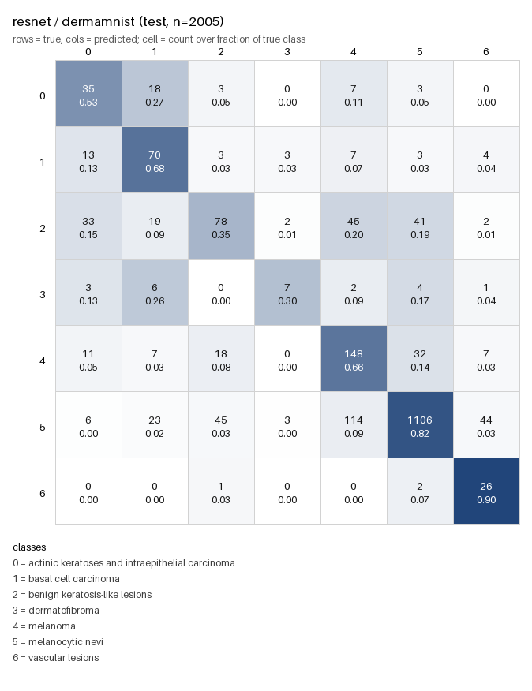

# Biomedical Image Classification with Knowledge Distillation — Reproducible Harness

Transfer learning and knowledge distillation on three MedMNIST benchmarks
(DermaMNIST, PneumoniaMNIST, BreastMNIST), with a seeded, checkpointed training
and evaluation pipeline built around the original experiments.

> ### Attribution
>
> The original experiments — the notebook [`biomed_kd_final.ipynb`](biomed_kd_final.ipynb),
> covering transfer learning across ResNet-50 / DenseNet-121 / EfficientNet-B0,
> the knowledge-distillation setup, and the Grad-CAM visualisations — were
> written by **[Akash Samanta](https://github.com/AkashSamanta2)**.
> Original repository:
> [Knowledge-Distillation-for-Lightweight-Models-under-Limited-Annotated-Biomedical-Data](https://github.com/AkashSamanta2/Knowledge-Distillation-for-Lightweight-Models-under-Limited-Annotated-Biomedical-Data).
> Reused here under the MIT licence, unmodified.
>
> **This repository adds** the reproducibility and evaluation layer described
> below: `train.py`, `evaluate.py`, `EXPERIMENTS.md`, `MODEL_CARD.md`,
> `requirements.txt`, and the measured results in `results/`.
> — *Nitin Joshi*

---

## Why this repository exists

The original notebook trains and reports entirely in memory. It sets no random
seed and never calls `torch.save`, so its published numbers cannot be
regenerated, audited, or built on — rerunning it produces different weights
every time, and the weights themselves are gone when the kernel exits.

It also reports **weighted** F1 as the headline metric. On DermaMNIST, where one
class is 67% of the test split, that metric is dominated by the majority class
and hides how the model performs on everything else — including melanoma.

This repository closes both gaps:

- **`train.py`** reproduces the notebook recipe parameter for parameter, and
  adds seeding, checkpointing with embedded run metadata, and a per-epoch
  history log. Every new option sits behind a flag; defaults are unchanged, so
  the original behaviour stays intact.
- **`evaluate.py`** reports macro-F1 alongside the weighted figures, plus
  per-class precision/recall/F1/support, balanced accuracy, a confusion matrix,
  and per-class one-vs-rest AUC — written to a machine-readable `metrics.json`.
- **`EXPERIMENTS.md`** defines the experiment protocol and a ranked backlog of
  candidate improvements, with expected gain, cost and risk for each.
- **`MODEL_CARD.md`** documents intended use, out-of-scope use, dataset caveats
  and known limitations.

---

## Architecture

```text
             MedMNIST (Derma / Pneumonia / Breast)
                            │
                            ▼
                  Preprocessing + augmentation
                            │
                            ▼
                ImageNet-pretrained backbone
        ┌───────────┬──────────────┬─────────────────┐
        │ ResNet-50 │ DenseNet-121 │ EfficientNet-B0 │
        └───────────┴──────────────┴─────────────────┘
                            │
                            ▼
              Fine-tune (Adam, AMP, early stopping)
                            │
              ┌─────────────┴─────────────┐
              ▼                           ▼
      Knowledge Distillation      evaluate.py
      teacher → EfficientNet      macro-F1, per-class,
      KL(T=3.0) + CE, α=0.7       confusion matrix, AUC
                                          │
                                          ▼
                                   metrics.json
```

| Role | Model |
|---|---|
| Teacher | ResNet-50, DenseNet-121 |
| Student | EfficientNet-B0 |

**Stack:** Python 3.14, PyTorch, torchvision, MedMNIST, scikit-learn, Pillow.

---

## Setup (Windows / PowerShell)

```powershell
python -m venv .venv
.\.venv\Scripts\Activate.ps1
python -m pip install --upgrade pip

# torch must come from PyTorch's own index -- PyPI serves CPU-only builds
python -m pip install torch==2.13.0+cu126 torchvision==0.28.0+cu126 `
    --index-url https://download.pytorch.org/whl/cu126
python -m pip install -r requirements.txt

python -c "import torch; print(torch.cuda.is_available())"   # must print True
```

Wheel availability on **Python 3.14 + Windows** is narrow and easy to get wrong.
The `cu129` index has **no** cp314 torchvision wheel at all — installing from it
fails, and `medmnist` then silently pulls a CPU-only torch from PyPI as a
dependency. `cu126`, `cu128` and `cu130` all work. The full matrix is in
[`requirements.txt`](requirements.txt).

Datasets download automatically on first run.

---

## Running

**Train** (defaults reproduce the notebook recipe exactly):

```powershell
python train.py --model resnet --dataset dermamnist --seed 42 `
    --run-name baseline_resnet_derma_seed42 `
    --out checkpoints\baseline_resnet_derma_seed42.pt
```

**Evaluate:**

```powershell
python evaluate.py --checkpoint checkpoints\baseline_resnet_derma_seed42.pt `
    --out results\baseline_resnet_derma_seed42.json `
    --cm-png results\baseline_resnet_derma_seed42_cm.png `
    --save-probs results\baseline_resnet_derma_seed42_probs.npz
```

Both accept `--model {resnet,densenet,efficientnet}`, `--dataset <medmnist flag>`,
`--batch-size`, and `--device`. See `--help` for the full set.

Metrics that cannot be computed — for example AUC for a class with no positive
test examples — are **omitted and recorded in a `warnings` array**, never filled
with a placeholder or a `NaN`.

---

## Serving API

`app.py` exposes the trained model over HTTP, with Grad-CAM explanations.

```powershell
$env:MODEL_PATH = "checkpoints\baseline_resnet_derma_seed42.pt"
python -m flask --app app run --port 8000
```

| Method | Endpoint | Returns |
|---|---|---|
| `GET` | `/health` | model/device status, 503 if no model loaded |
| `GET` | `/classes` | class index → label mapping |
| `POST` | `/predict` | class probabilities for an uploaded image |
| `POST` | `/explain` | Grad-CAM overlay as PNG (`?class_index=N` to target a class) |

```powershell
curl.exe -F "image=@lesion.png" http://localhost:8000/predict
curl.exe -F "image=@lesion.png" http://localhost:8000/explain -o cam.png
```

Every JSON response carries a `disclaimer` field, and `/predict` reports
`"calibrated": false` — softmax outputs are not calibrated probabilities and
must not be read as confidence. See [`MODEL_CARD.md`](MODEL_CARD.md).

The API reuses `build_model` and `build_eval_transform` from `evaluate.py`
rather than redefining them. Serving preprocessing that drifts from evaluation
preprocessing is the classic train/serve skew bug; there is one definition.

The Grad-CAM implementation is a rewrite rather than a copy of the notebook's,
which had three defects: it used the deprecated `register_backward_hook`,
registered hooks on every call without ever removing them (so repeated calls
stacked hooks on the same model), and divided by zero when the activation map
was entirely non-positive. The version here scopes hooks to a `with` block and
guards the normalisation.

## Docker

```powershell
docker build -t medmnist-kd-api .

docker run --rm -p 8000:8000 `
    -v "${PWD}\checkpoints:/models:ro" `
    -e MODEL_PATH=/models/baseline_resnet_derma_seed42.pt `
    medmnist-kd-api
```

Design notes, explained in full inside the [`Dockerfile`](Dockerfile):

- **Multi-stage.** Dependencies install into a virtualenv in a builder stage;
  only that virtualenv reaches the final image. pip's cache and build scratch
  never ship.
- **Base image pinned by digest**, not just tag — the same tag resolves to
  different bytes over time, so a tag-pinned build is not reproducible.
- **`requirements-serve.txt` copied before the source.** Docker caches layers in
  order and invalidates everything below a change. The ~200 MB torch install
  depends only on the dependency manifest, so editing `app.py` rebuilds one
  cheap layer instead of reinstalling torch.
- **CPU torch** (~200 MB vs ~2.6 GB for CUDA) and a serving-only dependency set
  that omits scikit-learn, pandas, matplotlib and seaborn — roughly 400 MB less.
- **Non-root user**, `HEALTHCHECK` against `/health`, and gunicorn with
  `--preload` so forked workers share one copy-on-write copy of the model.
- **The model is mounted, not baked in**, so image version and model version
  stay independent and a retrain does not require a rebuild.

---

## Results

### Seeded baseline — ResNet-50 / DermaMNIST

RTX 4050 (6 GB), 11 epochs, 13.7 min, early stopped at patience 5.
Full record in [`EXPERIMENTS.md`](EXPERIMENTS.md);
raw output in [`results/`](results/).

| Metric | Value |
|---|---:|
| Accuracy | 0.7332 |
| Weighted-F1 | 0.7450 |
| **Macro-F1** | **0.5224** |
| Balanced accuracy | 0.6077 |
| Macro AUC (OvR) | 0.9307 |

| Class | Precision | Recall | F1 | Support |
|---|---:|---:|---:|---:|
| actinic keratoses / intraepithelial carcinoma | 0.3465 | 0.5303 | 0.4192 | 66 |
| basal cell carcinoma | 0.4895 | 0.6796 | 0.5691 | 103 |
| benign keratosis-like lesions | 0.5270 | 0.3545 | 0.4239 | 220 |
| dermatofibroma | 0.4667 | 0.3043 | 0.3684 | 23 |
| **melanoma** | 0.4582 | **0.6637** | 0.5421 | 223 |
| melanocytic nevi | 0.9286 | 0.8248 | 0.8736 | 1341 |
| vascular lesions | 0.3095 | 0.8966 | 0.4602 | 29 |



### What the baseline shows

**Accuracy 0.7332 matches the original notebook's 0.7332**, despite using a
different seed where the notebook used none. That agreement is the evidence that
`train.py` faithfully reproduces the original recipe.

**Weighted-F1 overstates the model by 0.22 against macro-F1** (0.7450 vs
0.5224). `melanocytic nevi` is 67% of the test split and carries the weighted
average; five of seven classes sit below F1 0.55. A model that predicted `nv`
for every input would score ~67% accuracy and ~0.11 macro-F1 — which is why
macro-F1 is the metric this project optimises.

**Melanoma recall is 0.6637.** Of 223 melanomas, 32 are classified as
melanocytic nevi and 18 as benign keratoses — **50 malignant lesions labelled
benign, 22% of melanoma cases**. This is the clinically important failure mode,
and it is invisible in both accuracy and weighted-F1.

**Macro AUC is 0.9307 while macro-F1 is 0.5224.** The model *ranks* classes well
— every class scores above 0.86 AUC — but `argmax` under a 67% majority prior
converts good ranking into poor decisions. That gap is measured headroom for
per-class threshold tuning rather than a modelling failure, and it is the
highest-value item in the improvement backlog.

### Prior results from the original notebook

Reported for continuity. These come from the notebook's saved cell outputs:
real numbers from a real run, but **unseeded and with no saved weights**, so
they cannot be reproduced or audited. The F1 column is **weighted** F1.

| Teacher | Model | Dataset | Accuracy | Precision | Recall | F1 (weighted) |
|:---|:---|:---|---:|---:|---:|---:|
| — | ResNet50 | PneumoniaMNIST | 82.85% | 86.54% | 82.85% | 81.35% |
| — | ResNet50 | BreastMNIST | 81.41% | 83.69% | 81.41% | 77.99% |
| — | ResNet50 | DermaMNIST | 73.32% | 76.42% | 73.32% | 74.18% |
| — | DenseNet121 | PneumoniaMNIST | 89.42% | 90.83% | 89.42% | 88.99% |
| — | DenseNet121 | BreastMNIST | 85.90% | 86.21% | 85.90% | 84.70% |
| — | DenseNet121 | DermaMNIST | 76.11% | 77.75% | 76.11% | 76.58% |
| — | EfficientNet-B0 | PneumoniaMNIST | 86.70% | 88.44% | 86.70% | 86.01% |
| — | EfficientNet-B0 | BreastMNIST | 84.62% | 84.08% | 84.62% | 84.07% |
| — | EfficientNet-B0 | DermaMNIST | 75.46% | 77.89% | 75.46% | 76.20% |
| ResNet50 | KD-EfficientNet | PneumoniaMNIST | 84.29% | 87.45% | 84.29% | 83.09% |
| ResNet50 | KD-EfficientNet | BreastMNIST | 83.97% | 83.40% | 83.97% | 83.14% |
| ResNet50 | KD-EfficientNet | DermaMNIST | 76.06% | 76.92% | 76.06% | 76.01% |
| DenseNet121 | KD-EfficientNet | PneumoniaMNIST | 87.02% | 88.81% | 87.02% | 86.35% |
| DenseNet121 | KD-EfficientNet | BreastMNIST | 85.26% | 84.85% | 85.26% | 84.48% |
| DenseNet121 | KD-EfficientNet | DermaMNIST | 76.76% | 78.11% | 76.76% | 76.95% |

Reading these honestly:

- **KD helped, but not uniformly.** Distilling from DenseNet-121 improved the
  student on all three datasets (+0.32, +0.64, +1.30 points). Distilling from
  ResNet-50 made it *worse* on two of three — PneumoniaMNIST 86.70 → 84.29 and
  BreastMNIST 84.62 → 83.97. Four of six teacher/dataset pairs improved.
- **Sub-1-point differences are not established.** On DermaMNIST the KD student
  (76.76%) edges the DenseNet-121 teacher (76.11%), but that is ~13 images out
  of 2,005 from a single unseeded run. Student-beats-teacher is a real
  phenomenon, but this margin does not demonstrate it.

---

## Dataset caveats

Read [`MODEL_CARD.md`](MODEL_CARD.md) before quoting any number.

**Resolution.** MedMNIST images are **28×28**, upsampled to 224×224 for the
ImageNet backbones. That upsample adds no information. Dermatoscopic diagnosis
depends on fine structure — pigment networks, dots and globules, streaks — which
does not survive at 28×28. Every number here is bounded by that, not by the
architectures.

**Population skew.** DermaMNIST derives from HAM10000, collected in Vienna,
Austria and Queensland, Australia — both predominantly light-skinned
populations. Darker skin tones are severely underrepresented. **This model
should be assumed not to generalise across skin tones**, and nothing here
measures that, because MedMNIST carries no demographic metadata.

**Possible lesion-level leakage.** HAM10000 contains multiple images of the same
physical lesion (~10,015 images across ~7,500 lesions). If the split partitions
by image rather than by lesion, near-duplicates can straddle train and test and
inflate scores. This has not been verified for the split used here.

**Class imbalance.** DermaMNIST test split: `nv` 1,341 of 2,005 (67%); `df` 23;
`vasc` 29. Metrics on the smallest classes rest on a couple dozen images — one
image changing outcome moves `df` recall by 4.3 points.

**Not a clinical tool.** No regulatory clearance, no prospective validation. See
[`MODEL_CARD.md`](MODEL_CARD.md).

---

## Known environment issue

On machines with Windows Application Control enabled, matplotlib's
`_backend_agg` DLL may be blocked. `pyplot` imports it regardless of which
backend is selected, so *every* matplotlib backend fails — including the
notebook's plotting cells. `evaluate.py` therefore renders its confusion matrix
with Pillow, and treats any plotting failure as a non-fatal warning so a
completed evaluation is never lost to a rendering error.

---

## Project structure

```text
.
├── biomed_kd_final.ipynb    original experiments (Akash Samanta)
├── train.py                 notebook recipe, seeded and checkpointed
├── evaluate.py              test metrics -> metrics.json + confusion PNG
├── app.py                   Flask API: /predict, /explain (Grad-CAM)
├── Dockerfile               multi-stage container for the API
├── .dockerignore            keeps the build context small
├── requirements.txt         training/eval deps, incl. CUDA wheel matrix
├── requirements-serve.txt   serving-only deps (CPU torch, much smaller)
├── EXPERIMENTS.md           protocol, ranked backlog, results log
├── MODEL_CARD.md            intended use, caveats, limitations
├── results/                 metrics.json, confusion matrices, probabilities
├── checkpoints/             weights (git-ignored, ~90 MB each)
├── LICENSE
└── README.md
```

---

## Status

The seeded baseline above is a **single run**. Seed-variance measurement (three
runs, differing only by seed) has not yet been done, so there is no established
noise floor and no improvement can yet be claimed over it. That is item E0 in
[`EXPERIMENTS.md`](EXPERIMENTS.md) and is the prerequisite for everything in the
improvement backlog.

## Licence

MIT. Original work © 2026 Akash Samanta; additions © 2026 Nitin Joshi.
See [`LICENSE`](LICENSE).
